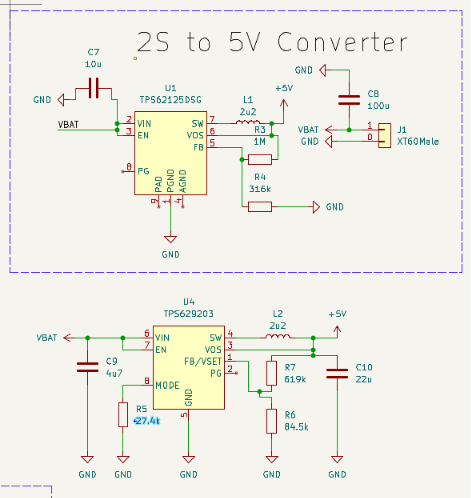
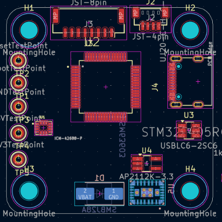

title: "Flight Controller"
author: "Diana"
description: "It must fly (i'll wrie it later)"
created_at: "2026-07-06"

----------------------
created_at: "2026-07-06"
Lapse Links: 
- [Lapse Schematics 1](https://lapse.hackclub.com/timelapse/7EcZ5cB8u3wI)
- [Lapse Schematics 2](https://lapse.hackclub.com/timelapse/V2QrQ_YrS28b)
Day 1: I am really excited to start this amazing project! 
I'll put a lot of work into this. I looked up some tutorials already, but a lot of them are too old and don't use modern technology or they use components I'd prefer not to.I want to start by following the schematics in the tutorial, and then, once I understand the full idea, switch to a completely different version created entirely by me.
I added the initial component schematics with the ESP32 WROOM Module. I might change it later, but it is currently missing a lot of components, so the tutorial has to add them and wire them up. This will help me better understand the internal structure of the ESP32 WROOM module. Even if I switch to more modern microcontrollers later, it will still help me progress faster because I will understand the internal wiring.
So, here is the basic structure of all the components that I've added and wired:
1) Microcontroller: I decided to go with the ESP32 WROOM 32.
2) CP2104: For USB-to-UART communication.
3) Flashing Sequence: For automatic firmware updates.
4) USB-B / USB-C: I will decide on one later. 
5) Motor Connectors: For connecting to the motors.
6) H-Bridge Circuit: For controlling the motors.
7) 3V3 Voltage Regulator: For stabilizing the input voltage to the ESP32.
8) Battery Charger: To prevent damage to the battery.
9) Accelerometer (MPU6050): This also contains a gyroscope, a temperature sensor, and a Digital Motion Processor that act as sensors for the controller's brain.

This is going to be an epic project, and I am really excited to begin. I am still not sure if this is the right controller to choose, but many tutorials suggest it, so who am I to go against them?
I like what I've done so far. Even though I am still not finished, I understand way more now by looking at tutorials and doing my own thing. I'll try to optimize it tomorrow.

---------------------
created_at: "2026-07-07"
Lapse Links: 
- [Lapse Schematics 3](https://lapse.hackclub.com/timelapse/JKiI6UassHQw)
Day 2: Even though I really enjoyed the progress of working on a lot of interesting stuff yesterday, there were too many unnecessary components. I changed the main controller to the Adafruit ESP32 Feather V2, which reduced the amount of components drastically.
This board has a lot of components already integrated into its internal structure, so I could alter the following elements:
1) Microcontroller: Adafruit ESP32 Feather V2. Why V2? It has USB-C and easier power management already integrated.
2) Removed CP2104: Already integrated into item 1. 
3) Removed Flashing Sequence: Already integrated into item 1.
4) Removed USB-B / USB-C: Already integrated into item 1.
5) H-Bridge Circuit: Upgraded to more modern DRV8833PWP drivers.
6) Removed 3V3 Voltage Regulator: Already integrated into item 1. 
7) Removed Battery Charger: Already integrated into item 1. 

Overall, the schematics look way more readable now, and the component switch was well worth the trouble. It did not take me that long, but it will definitely make assembly way easier.

--------------------
created_at: "2026-07-08"
Lapse Links: 
- [Lapse Schematics 4](https://lapse.hackclub.com/timelapse/zhmaA2kOq_Py)
Day 3: To use more powerful motors, my infrastructure allows me to switch from a 1S to a 2S LiPo battery. This is mainly due to the DRV8833PWP drivers, which accept 2.7V to 10.8V — a span that falls right into the 2S range. To make this work, I chose the TPS62125DSG step-down regulator. I was wondering how to connect the battery to the PCB itself and settled on the Amass XT60PW male PCB-mount connector. Most JST connectors are too weak, and an XT90 is overkill. I ended up a bit confused by all the different power inputs and outputs, but I eventually figured out the wiring and ended up with the following schematic:

--------------------
created_at: "2026-07-11"
Lapse Links: 
- [Lapse Schematics 5](https://lapse.hackclub.com/timelapse/zi6OlWzVVC0I)
Day 4: Today I made significant modifications to the flight controller design. I stepped up from a simple 2S brushed drone concept to the prototype architecture of a real 4S 7" brushless drone.

1. Updated the buck converter

I replaced the TPS62125 with the newer TPS629203, which supports my new power requirements and offers better efficiency. 

2. Switched from brushed to brushless architecture

Initially, I considered replacing the DRV8833PWP because it is obsolete with the DRV8847PWPR. However, since I had to redesign the motor-driving stage anyway, I decided it made more sense to switch to brushless motors and use a dedicated 4-in-1 ESC instead of H-bridges.

Because the TPS629203 supports a 4S LiPo, I also upgraded the battery from 2S to 4S. This removed the need for additional power circuitry changes and resulted in a much cleaner flight controller schematic.

3. Selected the propulsion system

To avoid designing around unknown components, I chose the motors first and built the rest of the system around them.

Motor: Hobbywing XRotor 2807 1300KV

Product:
https://hobbywinguav.com/product/2807/

Datasheet:
https://www.hobbywing.com/uploads/file/20250207/46cccf132a1b9971633a272da27fb76f.pdf

4. Selected the ESC

Since I switched to brushless motors, I removed the H-bridge motor drivers and replaced them with a 4-in-1 ESC.

After comparing several candidates and checking compatibility with the selected motors, I chose the:

Hobbywing XRotor 65A 4-in-1 Lite BLS V2 ESC

Datasheet:
https://www.hobbywing.com/en/uploads/file/20251120/81969c41227e3db78d441e9c20476cf1.pdf

Product:
https://www.drone-fpv-racer.com/en/hobbywing-65a-4in1-6s-lite-bls-v2-fpv-esc-15678.html
[BLS Version](<Images/Screenshot 2026-07-11 032116.png>)

5. Updated motor connections

I initially changed the motor connectors to 3-pin connectors for brushless motors.

Later, I realised that since the motors connect directly to the ESC, the flight controller PCB does not need motor connectors. Therefore, I removed them from the schematic.

6. Added battery monitoring

I added:

Battery voltage monitoring using a resistor divider connected to an ESP32 ADC pin.
Battery current monitoring using the ESC's analog current output connected to another ESP32 ADC pin.
ESC telemetry connected to a UART RX pin on the ESP32.
 
 
7. Updated the power architecture

The battery is now connected directly to the ESC through an XT60 connector.

I also added:

a 680 µF bulk capacitor (provided with the ESC),
a TVS diode across VBAT and GND for transient protection.

TODO:
- Replace the ESP32 Feather development board with a custom ESP32 circuit in the final design.
- Verify the ESC telemetry connector (SH1.0) and determine the best way to interface it with my PCB.
- Verify that the ESC current output is 3.3 V compatible before connecting it directly to the ESP32 ADC.
- Run KiCad ERC and begin PCB layout.

--------------------
created_at: "2026-07-12"
Lapse Links: 
- [Lapse Schematics 6](https://lapse.hackclub.com/timelapse/6Uwn8jtsZGfW)
- [Lapse Schematics 7](https://lapse.hackclub.com/timelapse/CSfY-yu12VB2)
- [Lapse Schematics 8](https://lapse.hackclub.com/timelapse/6Uwn8jtsZGfW)
- [Lapse Schematics 9](https://lapse.hackclub.com/timelapse/6Uwn8jtsZGfW)
Day 5: Today I replaced the ESP32 Feather V2 development board with the actual ESP32-S3-WROOM-1U module and all of the supporting circuitry required for a production PCB. The Feather dev board served me well for prototyping, but it was time to move to a real hardware design.
ESP32
- Removed the Adafruit ESP32 Feather V2 development board.
- Switched to the ESP32-S3-WROOM-1U module.
- Added the required support circuitry:
  - EN reset circuit
  - BOOT button
  - USB-C connector
  - USB D+ / D− wiring
  - Decoupling capacitors
  - Voltage divider for battery monitoring

ESP32-S3-WROOM-1U datasheet:
https://documentation.espressif.com/esp32-s3-wroom-1_wroom-1u_datasheet_en.pdf
Originally the design targeted a 4S battery:

I added:
- test points for debugging,
- PCB mounting holes,
- improved power distribution.

I then decided to redesign the power supply so the flight controller can support both **4S and 6S LiPo batteries**.

The previous TPS629203 regulator was replaced with the **TPSM63603**, which supports input voltages up to 36 V.

TPSM63603 datasheet:
https://www.ti.com/lit/ds/symlink/tpsm63603.pdf

I created a custom KiCad symbol for the TPSM63603:

Then I integrated and wired the new regulator into the schematic:

After my laptop crashed, I noticed the screen recorder froze for the last ~10 minutes and only recorded a still image. I added a screenshot of the completed work as proof of progress.

## TODO:
- Verify the TPSM63603 wiring against the TI reference schematic.
- Check all capacitor values and voltage ratings.
- Verify the feedback resistor values for a 3.3 V output.
- Add a capacitor on the battery voltage monitoring line (V_MON).
- Run ERC before starting PCB layout.
- Begin PCB component placement.
- Go touch the grass and finally sleep.

--------------------
created_at: "2026-07-13"
Lapse Links:
- [Lapse Schematics 10](https://lapse.hackclub.com/timelapse/1pxt6WZpChBw)
- [Lapse Schematics 11](https://lapse.hackclub.com/timelapse/10gVjKCt_ep9)
- [Flight Controller Footprints 1](https://lapse.hackclub.com/timelapse/hQegLY-AzRu6)
- [Flight Controller Footprints 2](https://lapse.hackclub.com/timelapse/EoTzfVyzHLk1)
- [Flight Controller Footprints 3](https://lapse.hackclub.com/timelapse/lF_Vx_5Nq1XL)
- [Flight Controller Components 1](https://lapse.hackclub.com/timelapse/Cr0G3cQVFeo1)

Day 6: Continued refining the flight controller schematic and completed the transition to support a **4S–6S LiPo** power input. I replaced the original 20 V TVS diode with a **Vishay SMBJ28A**, which has a 28 V reverse working voltage, making it suitable for a fully charged 6S LiPo (25.2 V) while still providing transient protection.

While reviewing the schematic, I discovered a short circuit by using KiCad's **Net Highlight** tool. Highlighting the **3.3 V** net also highlighted **GND**, immediately indicating a direct short. After tracing the connection, I found that the ESP32's 3.3 V decoupling capacitors had been wired incorrectly. Fixing the capacitor connections removed the short.

With the power circuitry corrected, I finished updating the schematic for reliable 4S–6S operation and performed a full schematic review, cleaning up ERC issues along the way.

The final result was reducing the ERC report from **more than 60 errors to zero**. Most of the remaining issues were caused by decorative net labels, intentionally unused pins, and missing ERC markers rather than actual electrical problems. After replacing decorative labels with graphical text, adding No Connect markers where appropriate, and fixing the genuine wiring mistakes, the schematic passed ERC without any errors.

--------------------
created_at: "2026-07-14"
Lapse Links:
- [Lapse 12](link)

Day 7: Moving on to Footprints.

Started assigning footprints to all components in the schematic. While selecting them, I also checked whether the chosen packages would actually be practical to solder by hand. For example, I verified that the 1210 package for the 630 V, 68 nF X7R MLCC (C10) should still be manageable for manual soldering.

I also created a few files that will continue to evolve throughout the project. They are not finished yet, but they need to be prepared before starting the actual PCB design if I want to build this flight controller in real life.

Bill of Material Exported from KiCad
Components References (manufacturer, part names, purchase links)

There were still many design decisions that required research before finalizing the PCB, including:

Choosing the correct footprint for the UJ20-C-H-G-SMT-2A-P16-TR USB-C connector and understanding which of its 16 pins are actually required for USB 2.0 operation.
Selecting appropriate test point sizes.
Deciding whether the external XRotor ESC should remain in the schematic without a footprint or be excluded from PCB generation.
Choosing suitable push buttons for the BOOT and RESET functions.
Verifying that the RESET circuit had not been forgotten and was wired correctly.

I spent quite a bit of time looking up components, comparing alternatives, and selecting footprints that match the actual parts.

I also used TI WEBENCH to generate and compare a custom implementation of the TPSM63603 buck converter and to better understand the recommended layout and surrounding components.

After going through the entire schematic, I assigned footprints to every component except the external ESC, which is not part of the flight controller PCB.

I also corrected several pin assignments and footprint mismatches that would have caused ERC errors later during the design process.

One thing I have learned is that designing the schematic itself is only part of the work. Researching components is surprisingly time-consuming. Every resistor, capacitor, connector, and integrated circuit has multiple possible variants, each with different voltage ratings, tolerances, packages, manufacturers, and availability. Learning the correct engineering terminology and understanding datasheets well enough to choose the appropriate parts has been one of the more challenging aspects of the project.

Fortunately, it looks like I should be able to purchase most of the required components from Mouser Finland, which would make ordering much simpler.

Another question that has started to interest me is whether designing and manufacturing a custom flight controller actually makes economic sense. After spending time designing the hardware, debugging it, ordering components, assembling the PCB, and testing everything, is there any real cost advantage left? Or is it simply cheaper to buy an already proven flight controller from one of the large Chinese manufacturers unless a very specific custom feature is needed?

Once I finish the ComponentsReferences.md file, I plan to add the price of every component and calculate the total cost of the flight controller. I'm genuinely curious to see what the final number will be and how it compares to commercially available flight controllers.

If you're reading this: Author wrote it sitting at the railway station with 12h of sleep in the past week. I'm kinda dedicated to this project and kinda wanna sleep. "To sleep or not to sleep?" - That is the question!

Fortunately, it looks like I should be able to purchase most of the required components from Mouser Finland, which will make ordering everything much simpler. However, finding actual components instead of just selecting values from a schematic turned out to be much more difficult than I expected. Every capacitor, resistor, connector, and protection device comes in dozens or even hundreds of variants with different package sizes, voltage ratings, tolerances, temperature characteristics, and manufacturers. Learning how to choose real parts that satisfy both the electrical requirements and are still practical to solder by hand has probably been one of the most time-consuming parts of the project so far. I documented the selected components in [Components References](../ComponentsReferences.md).

-------
created_at: "2026-07-17"
Lapse Links:
- [Flight Controller Schematics 12](https://lapse.hackclub.com/timelapse/qFTWT7Qf1Yv2)
- [Flight Controller Schematics 13](https://lapse.hackclub.com/timelapse/cIjbhHLziKkF)
- [Flight Controller Footprints 4](https://lapse.hackclub.com/timelapse/JtB1HHLpG3G7)

Day X: Betaflight It Is

Decided to drop the idea of writing custom firmware and instead target Betaflight for the first revision of the flight controller. This meant replacing the ESP32-S3 with the STM32F405RGT6, rewiring the MCU, and redesigning the project around hardware already supported by the Betaflight ecosystem.

Initially I considered the MPU6000 because of its popularity, but it is getting old and harder to source. Instead, I switched to the ICM-42688-P, which offers better performance while still being supported. I also found an evaluation board, so if anything goes wrong I can always inspect a working design or even salvage the chip if necessary.

Moved all custom libraries into the project directory to make the repository self-contained. Reworked the STM32 power circuitry by connecting all required digital and analog supply pins according to the datasheet and referenced official development board schematics to verify the implementation.

Simplified the boot and reset circuits to save PCB space. Instead of dedicated buttons, both BOOT0 and NRST are exposed as test pads. BOOT0 is held low by default through a pull-down resistor so Betaflight boots normally, and can be pulled high to 3.3 V only when entering the STM32 bootloader for firmware flashing.

Although the primary target is Betaflight, the hardware should also be capable of running ArduPilot with some limitations, so I tried to keep the design compatible with both ecosystems.

The IMU interface was changed from I²C to SPI for better performance and lower latency, which is the preferred configuration for modern flight controllers.

The power architecture was expanded to include both 5 V and 3.3 V rails. The TPSM63603 now generates the 5 V supply for peripherals such as the ExpressLRS receiver, with room for a future FPV camera and LiDAR module, while an AP2112K-3.3 LDO provides a clean 3.3 V rail for the MCU and sensors. I also added a JST connector for the receiver.

Spent quite some time chasing electrical rule check issues—at one point there were 41 ERC errors, but eventually got the count down to zero.

Updated the Bill of Materials with production-ready components and, after breaking most of the footprint assignments during the redesign, rebuilt all footprints from scratch. It was honestly faster than trying to fix the old assignments one by one.

 
 Btw, I really like this journal entry. Rereading it makes me understand that this project has taught me more than I expected. 

 -------
 Switched stm32 footpront. started adding 3d models. changed usb c sym to be alliged with footpront. fixed yest mist - for imu test pint as footprt was. fixed TPSM63603 which was missing 3 pins. 

 Warning: No net found for component J2 pad MP (no pin MP in symbol).
Warning: No net found for component J3 pad MP (no pin MP in symbol).
Warning: No net found for component J2 pad MP (no pin MP in symbol).
Warning: No net found for component J3 pad MP (no pin MP in symbol).

Fixed footprint/sym mismatch issues. must have a ref for place, looking for 1 from real fcs. final schematics for now 

 what i have to wire

Fixed symbols/footprints mismatch. Added pins, upadated and modified several symbols and footprints to at the end of the process achive 0 import errors. .
time to separarte into top and bottom parts. size of fc must mutch the esc. made +- border of 30.5 between slew and 39*39 with 3.2 fillet main pcb. onto anddin C nad R and Fb super a lot and hard.
