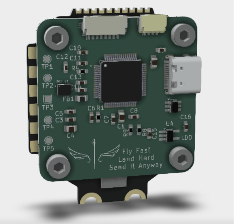
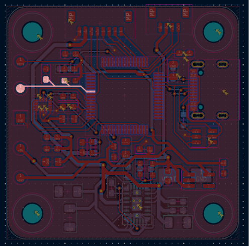

# Firmware

The hardware has been designed primarily for Betaflight running on the STM32F405RGT6 microcontroller. Although the PCB has not yet been manufactured, the firmware workflow has already been planned to simplify the bring-up process once the first revision of the board arrives.

The STM32 provides two programming interfaces. During development I intend to use the SWD interface together with an ST-Link programmer, as it allows full debugging and recovery even if the firmware becomes corrupted. For normal firmware updates, the USB Type-C connector can be used through the STM32 built-in DFU bootloader.

---

## Programming Interfaces

The board exposes two independent programming methods.

### SWD

The SWD interface is available through dedicated test pads exposing:

- SWDIO
- SWCLK
- NRST
- 3.3 V
- GND

This interface will be used for the initial bring-up of the board, firmware development and debugging.

 

---

### USB DFU

The STM32F405 contains a factory bootloader stored in ROM. By pulling **BOOT0** high during reset, the MCU enters Device Firmware Upgrade (DFU) mode and can be programmed directly over the USB Type-C connector without requiring an external programmer.

Both **BOOT0** and **NRST** are exposed as SMD test pads instead of push buttons in order to reduce PCB size.

---

## First Power-Up

Once the PCB is assembled, the first goal is simply to verify that the hardware behaves as expected before any flight firmware is installed.

The planned validation sequence is:

1. Verify that there are no shorts on the power rails.
2. Apply power from a current-limited bench supply.
3. Confirm that the 5 V rail is generated correctly.
4. Verify the 3.3 V regulator output.
5. Ensure that the STM32 starts correctly.
6. Test USB enumeration.
7. Verify SWD communication.
8. Confirm SPI communication with the IMU.
9. Validate battery voltage and current sensing.

Only after these checks pass will Betaflight be flashed.

---

## Betaflight

The hardware was designed around the STM32F405 specifically because it is well supported by Betaflight.

Once the board has been electrically validated, the next milestone will be creating a custom Betaflight target describing the hardware configuration, including the IMU, motor outputs, UART assignments and ADC channels.

After the target is complete, the board should be configurable directly through Betaflight Configurator.

Link: https://betaflight.com/
Configurator: https://app.betaflight.com/

---

## Future Development

The first revision focuses entirely on reliable flight control hardware. Once basic functionality has been verified, future firmware development will expand to include additional peripherals such as GPS, LiDAR, barometer support and, eventually, evaluation of ArduPilot compatibility.