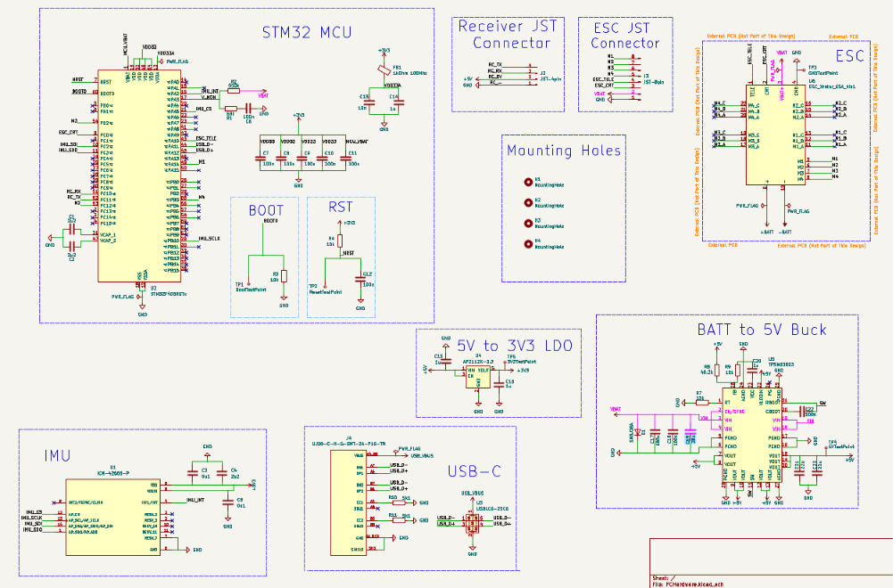
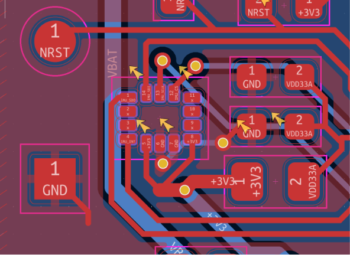

# Hardware

This document describes the hardware design of the custom STM32F405-based flight controller developed throughout this project. The goal was to create a compact flight controller suitable for modern 4S–6S FPV drones while understanding every subsystem involved in the design process, from power regulation and sensor integration to PCB layout and mechanical compatibility.

The board follows the standard **30.5 × 30.5 mm mounting pattern**, allowing it to stack directly with compatible 4-in-1 ESCs such as the Hobbywing XRotor 65A used during development.

---

## Hardware Overview

The controller is built around the **STM32F405RGT6**, an ARM Cortex-M4 microcontroller widely used by the Betaflight ecosystem. Besides offering native USB support and sufficient processing power for modern flight control algorithms, choosing this MCU also makes future firmware development significantly easier due to the amount of existing documentation and community support.

Motion sensing is provided by the **ICM-42688-P** inertial measurement unit connected over SPI. Using SPI instead of I²C reduces communication latency and allows significantly higher update rates, which are essential for responsive flight control.

The board is powered directly from a **4S–6S LiPo battery**. Power conversion is performed in two stages. First, a TPSM63603 synchronous buck converter generates a regulated 5 V rail from the battery voltage. A dedicated AP2112K-3.3 low-dropout regulator then provides a clean 3.3 V supply for the microcontroller, IMU and other sensitive digital circuitry. Separating the switching regulator from the digital supply helps reduce switching noise reaching the sensors.

Battery voltage is measured using a resistor divider connected to one of the STM32 ADC inputs, while current consumption is obtained from the ESC's analog current output. These measurements allow the firmware to estimate battery state and power consumption during flight.

Communication with the ESC is performed using the DShot digital protocol, while ESC telemetry provides additional runtime information. An ExpressLRS receiver connects through UART, and additional communication interfaces have been reserved for future peripherals such as GPS, barometers or LiDAR modules.

---

## PCB Design

The PCB was designed as a two-layer board with a continuous ground plane on both sides wherever possible. Particular attention was given to minimizing return current paths, placing decoupling capacitors close to their respective power pins and keeping high-speed SPI traces as short as practical.

USB differential pairs were routed together with matched topology, while power routing was prioritised before signal routing to ensure sufficient copper width on higher-current nets. Throughout the routing process I attempted to minimise unnecessary vias and avoided routing beneath sensitive analog circuitry whenever practical.

Rather than striving for the shortest possible traces everywhere, the layout prioritises predictable current flow, clean power distribution and component placement that follows each manufacturer's layout recommendations.

---

## Power Architecture

Power distribution is one of the most critical parts of the design. Since the board operates directly from a LiPo battery whose voltage changes significantly during discharge, careful regulation is required before powering the digital electronics.

The TPSM63603 generates the main 5 V rail from the battery input. This rail supplies external peripherals while also feeding the AP2112K regulator responsible for generating the clean 3.3 V supply used by the STM32, IMU and supporting circuitry.

Each power domain includes local decoupling capacitors positioned according to the manufacturers' recommendations. Ferrite bead filtering is also used to isolate particularly noise-sensitive sections of the circuit.

---

## Microcontroller

The STM32F405 acts as the central controller for the entire system. It communicates with the IMU over SPI, receives radio commands through UART, generates DShot motor outputs and continuously monitors battery voltage and current through its ADC peripherals.

USB Full-Speed support allows firmware flashing and configuration without requiring an external programmer once the board has been brought up successfully.

During development, SWD remains the preferred programming interface because it provides full debugging capabilities and recovery if the firmware becomes corrupted.

---

## IMU

Orientation of the ICM-42688-P follows the manufacturer's recommended reference frame to simplify firmware configuration. Special attention was given to local power decoupling and short SPI routing in order to reduce supply noise and communication latency.

The IMU communicates with the STM32 through dedicated SPI lines together with an interrupt line used for high-frequency sensor updates.

---

## External Interfaces

The board exposes several interfaces required by a modern flight controller.

A USB Type-C connector provides firmware flashing and configuration together with integrated ESD protection. Programming and debugging are additionally supported through dedicated SWD test pads.

Motor control is performed through DShot outputs connected to the ESC, while ESC telemetry and analog current sensing return runtime information back to the STM32.

An ExpressLRS receiver connects through UART, and additional interfaces remain available for future expansion.

---

## Test Points

Instead of dedicating valuable PCB space to buttons and programming headers, several functions are exposed through SMD test pads.

The board includes accessible test points for:

- 3.3 V
- 5 V
- Ground
- BOOT0
- NRST
- SWD programming

These pads simplify firmware flashing, debugging and hardware validation while keeping the PCB compact.

---

## Revision 2 Ideas

The most significant changes would include improving the routing around the buck converter, refining connector placement to simplify assembly, integrating more cleanly with the ESC stack, and exposing additional communication interfaces for peripherals such as GPS and LiDAR. Hardware validation of the first manufactured revision will ultimately determine which of these changes provide the greatest benefit.