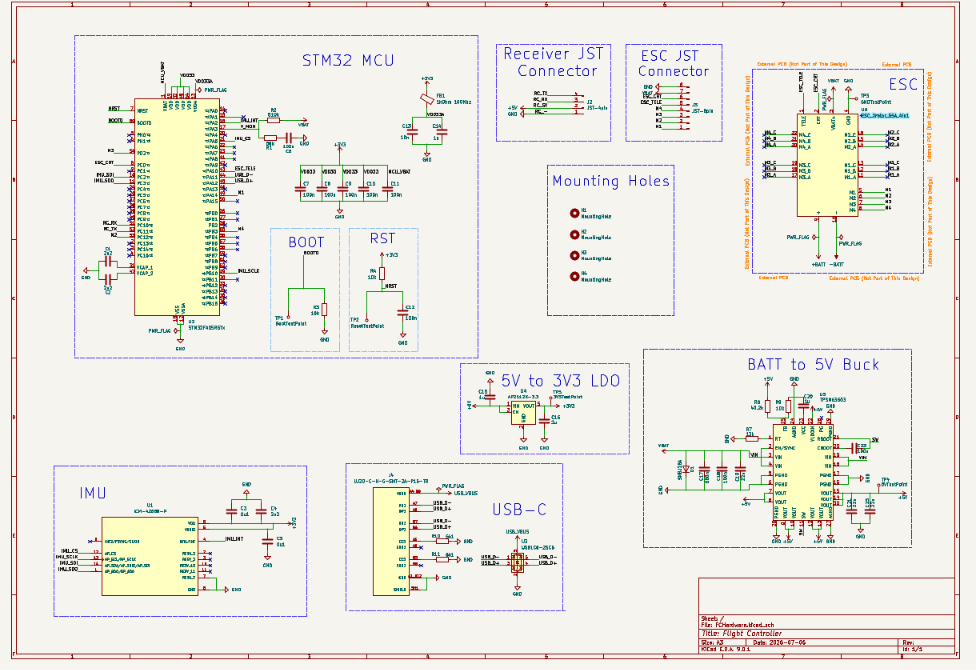
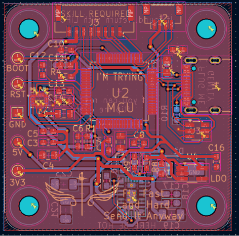
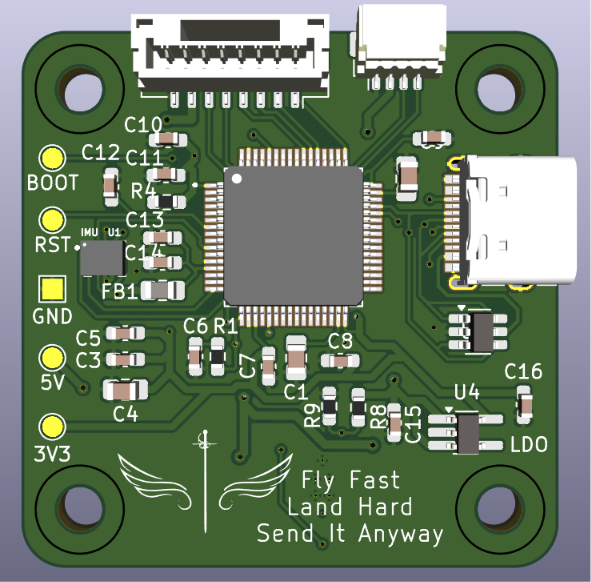
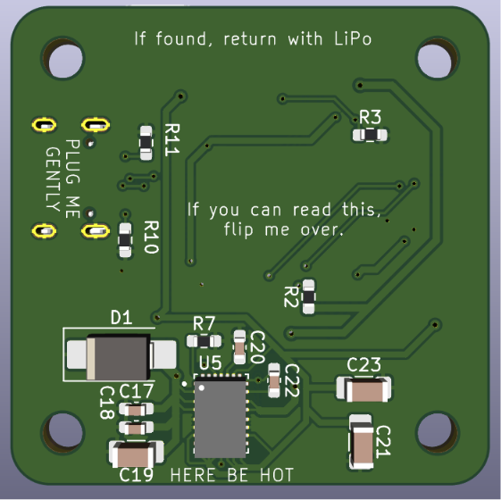
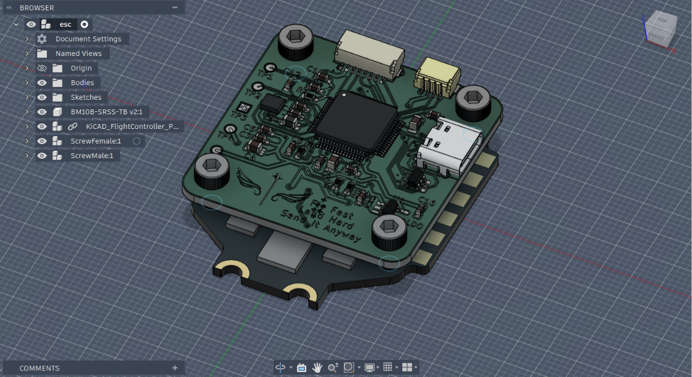
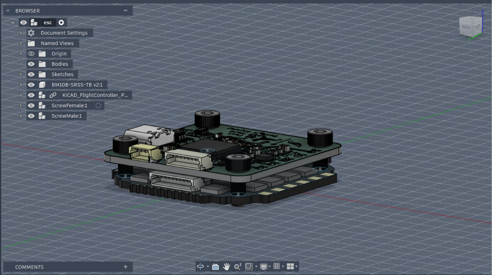

# Custom Flight Controller

> **Fly Fast. Land Hard. Send It Anyway**

A custom STM32F405-based flight controller designed from the ground up for modern FPV drones. The project covers the complete hardware development process—from schematic capture and PCB layout to mechanical integration and 3D CAD assembly.

The primary goal is to create a fully functional **Betaflight-compatible** flight controller while keeping the hardware flexible enough for future **ArduPilot** support and additional onboard peripherals.

An interactive preview of the complete assembly is available on Autodesk Viewer: https://autode.sk/4bVkogq

# A Note to the Reviewer

Dear Reviewer,

Thank you for taking the time to look through this project.

This repository documents the design and development of my first large-scale hardware project — a custom STM32F405-based flight controller designed entirely in KiCad.

Everything you see in this repository—from the schematic and component selection to the PCB layout, routing, design rules, mechanical integration, and documentation—was developed from scratch. I did not follow a tutorial or replicate an existing flight controller design. Throughout the project, the primary sources of information were component datasheets, manufacturer reference manuals, application notes, and publicly available technical documentation.

I understand that this approach required significantly more time than following an existing design, but that was an intentional decision. Working through the design myself forced me to understand not only *what* needed to be done, but *why*. Every mistake, redesign, and challenge became an opportunity to learn something new, and I believe that experience has been far more valuable than simply reproducing someone else's work.

Like any real engineering project, the repository documents mistakes, redesigns, and the reasoning behind many design decisions. I intentionally logged my personal opinions on what is going on in the development journal rather than only presenting the bare facts because I believe the engineering process is just as valuable as the finished PCB.

Due to the time and financial constraints of this project, it was not feasible to manufacture the PCB, assemble a complete drone, and perform hardware validation and flight testing before the Horizons' submission deadline. The current demonstration therefore focuses on the completed hardware design, documentation, and the mechanical integration of the flight controller with its intended ESC.

I also do not currently hold a drone pilot certificate, although I hope to obtain one in the future. Once I have the necessary resources and experience, I plan to continue this project by manufacturing the PCB, bringing up the hardware, developing the firmware, integrating the controller into a complete drone, and carrying out real-world flight testing as part of future Hack Club projects.

---

## Documentation

The repository contains additional documentation describing both the hardware and firmware aspects of the project.

Detailed information about the PCB architecture, power distribution, interfaces, mechanical design, manufacturing considerations, and future hardware revisions can be found in **`Docs/Hardware.md`**.

Firmware-related documentation, including programming interfaces, flashing instructions, hardware bring-up, Betaflight target information, and the planned firmware development roadmap, is available in **`Docs/Firmware.md`**.

---

## Repository Structure

```text
FlightController/
├── CAD_Rendered/             # Fusion 360 assembly and mechanical models
├── FCHardware/               # KiCad project files
├── Devlogs/
│   ├── Images/               # Figures and renders
│   └── Journal.md            # Development journal
├── Docs/
│   ├── Hardware.md
│   └── Firmware.md
├── ComponentsReferences.csv  # Component purchasing references (BOM)
├── FCHardware.csv            # Design references and documentation
└── README.md
```

---

## Gallery

### Schematic Overview



### PCB Layout (2D)



### PCB Front (3D)



### PCB Back (3D)



### Fusion 360 Assembly




---

## Acknowledgements

This project would not have been possible without the excellent documentation, reference manuals, and open-source resources provided by the engineering community. I would like to thank the manufacturers and developers whose work made this project possible.

Special thanks to:

- **STMicroelectronics** for the STM32 documentation and software ecosystem.
- **TDK InvenSense** for the ICM-42688-P documentation.
- **Texas Instruments** and **Diodes Incorporated** for detailed power management documentation.
- **Betaflight** for developing and maintaining an outstanding open-source flight control firmware.
- **Sahil Parashar** for providing the generic ESC model that was adapted for this project.
- **KiCad** for creating an exceptional open-source EDA suite.
- **Autodesk** for Fusion 360.
- **My family and friends** for their encouragement and support throughout the project.

---

*"Fly Fast. Land Hard. Send It Anyway"*