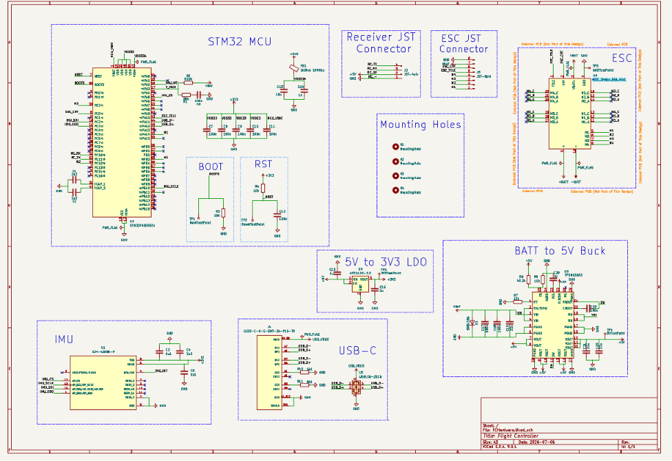
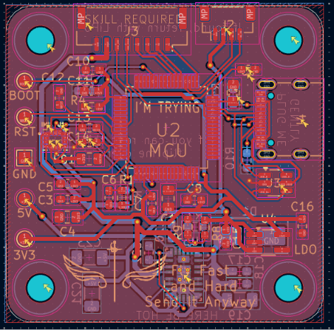
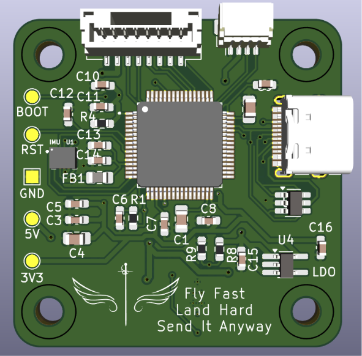
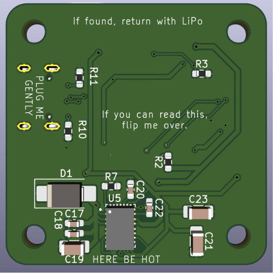
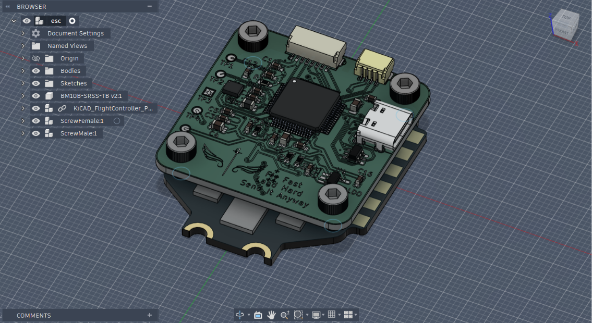
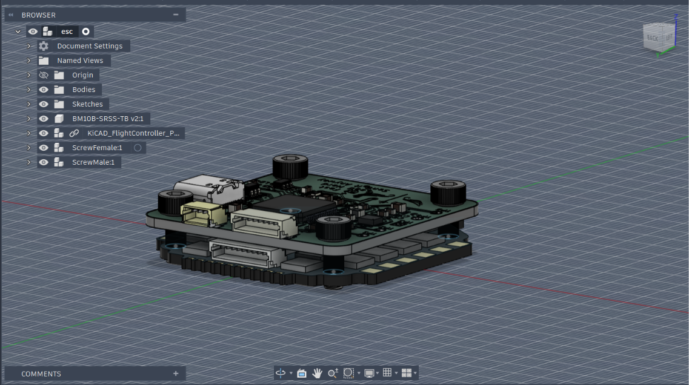

# Custom Flight Controller

A custom STM32F405-based flight controller designed from the ground up for modern FPV drones. Supports 4S–6S LiPo batteries, four ESC outputs with DShot, USB-C programming, and the ICM-42688-P IMU. The repository includes complete schematics, PCB design, CAD assembly, hardware documentation, and firmware flashing/bring-up guides. Designed for Betaflight compatibility with future ArduPilot support and additional onboard peripherals.

A preview of the complete assembly by Autodesk Viewer: https://autode.sk/4bVkogq

---

## Documentation

The repository contains additional documentation describing both the hardware and firmware aspects of the project.

Detailed information about the PCB architecture, power distribution, interfaces, mechanical design, manufacturing considerations, and future hardware revisions can be found in **`Docs/Hardware.md`**.

Firmware-related documentation, including programming interfaces, flashing instructions, hardware bring-up, Betaflight target information, and the planned firmware development roadmap, is available in **`Docs/Firmware.md`**.

---

## Repository Structure

FlightController/
├── CAD_Rendered/             # Fusion 360 assembly and mechanical models
├── FCHardware/               # KiCad project files
├── Devlogs/                  # The overall folder with devlog documents
│   ├── Images/                 # Figures and renders
│   └── Journal.md              # Development journal
├── Docs/                     #Documentation
│   ├── Hardware.md         
│   └── Firmware.md
├── ComponentsReferences.csv  # Component purchasing references (BOM)
├── FCHardware.csv            # Design references and documentation
└── README.md

---

## Gallery

### Schematic Overview

### PCB Layout (2D)

### PCB Front (3D)

### PCB Back (3D)

### Fusion 360 Assembly

---

## Acknowledgements

This project would not have been possible without the documentation, manuals, and resources provided by the engineering community. 

Special thanks to:
- STMicroelectronics, TDK InvenSense, Texas Instruments, Diodes Incorporated, Betaflight, Sahil Parashar for providing the generic ESC model that was adapted for this project, KiCad, Autodesk.
- **My family and friends** for their encouragement and support throughout the project.
